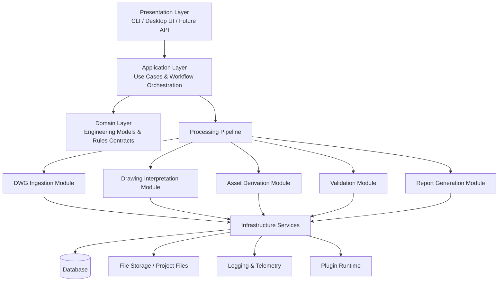
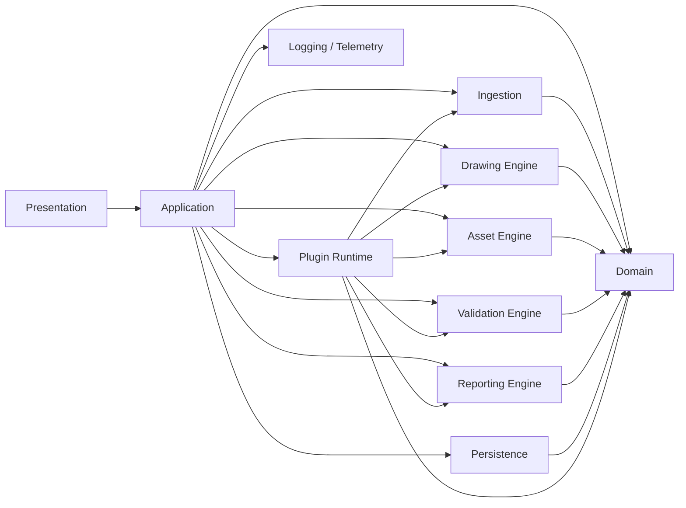
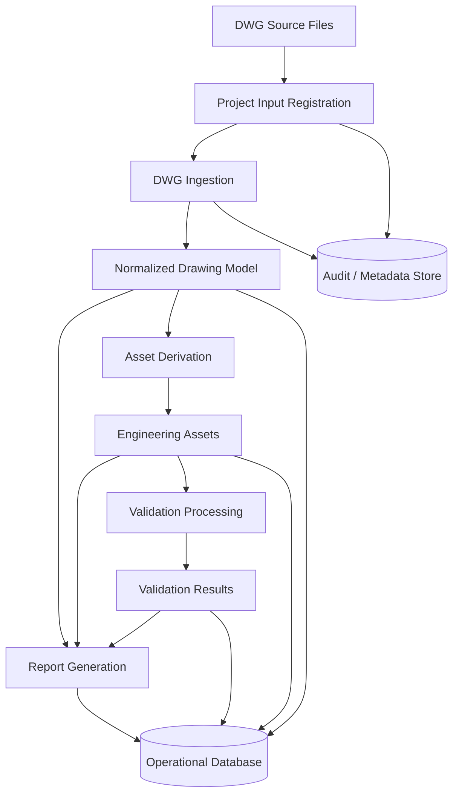
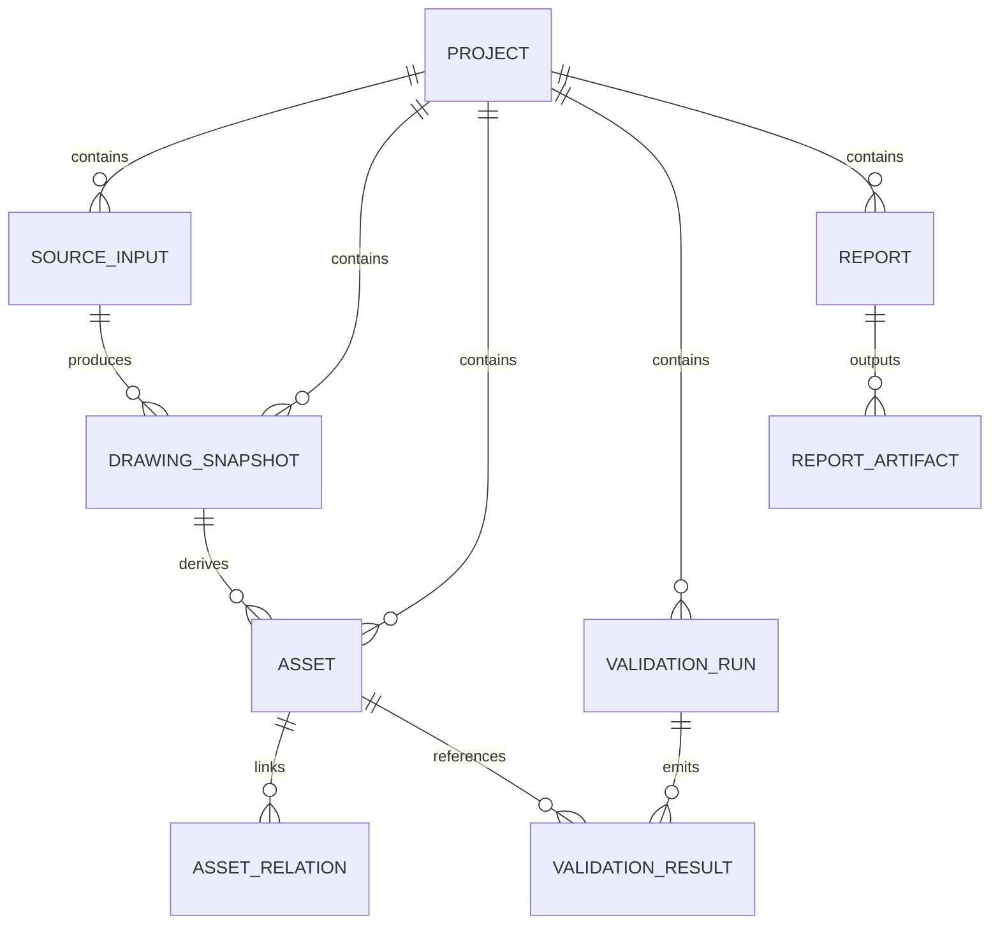
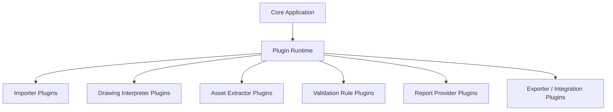
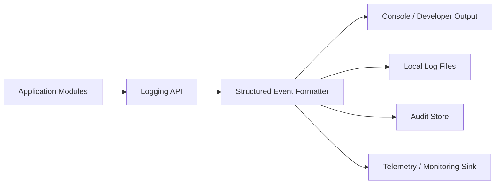

# SDS-002 – System Architecture

## 1. Purpose

This document defines the target system architecture for the **Airfield Ground Lighting (AGL) Engineering Toolkit (AET)**. It establishes the structural design of the application after repository foundation work completed in **SDS-001**, while intentionally avoiding implementation-specific business logic at this stage.

The goal of this architecture is to provide a scalable, maintainable, and traceable platform for processing airfield engineering drawing data, deriving engineering assets and validations, and producing auditable reports.

## 2. Scope

SDS-002 covers:

- Complete application architecture
- Module boundaries and responsibilities
- Data flow from DWG ingestion to reporting outputs
- Database architecture
- Plugin architecture
- Logging and observability architecture
- Error handling strategy
- Future scalability considerations

SDS-002 does **not** define:

- Detailed business rules
- Domain validation logic
- Final UI wireframes
- Concrete algorithm implementations
- Production deployment topology

## 3. Architectural Goals

The architecture is designed to satisfy the following goals:

1. **Separation of concerns** between ingestion, domain modeling, validation, reporting, persistence, and presentation.
2. **Traceability** from source drawing inputs to derived assets, validations, and reports.
3. **Extensibility** through plugins for future engineering rules, importers, exporters, and report generators.
4. **Auditability** for engineering workflows, transformation stages, and validation outcomes.
5. **Resilience** through explicit error boundaries and recoverable processing stages.
6. **Scalability** so future releases can support larger projects, more file formats, more rules, and multi-user workflows.
7. **Implementation independence** so architecture can guide later coding work without locking the project to premature technical details.

## 4. High-Level Architecture Overview

AET should be structured as a layered, modular application with a pipeline-oriented processing core.

### 4.1 Primary Architectural Style

The recommended style is a **modular monolith with plugin-ready boundaries**.

This approach is appropriate because:

- The project is at an early stage and benefits from low operational complexity.
- Domain consistency is easier to maintain inside one codebase and one process model initially.
- Clear internal boundaries allow future extraction of services if scale or organizational needs justify it.
- The architecture can support desktop, CLI, or service-hosted interfaces later without redesigning the domain core.

### 4.2 Major Architectural Layers

1. **Presentation Layer**
   - CLI, desktop UI, or future web/API entry points
   - User workflows, commands, views, and orchestration requests

2. **Application Layer**
   - Use cases
   - Workflow orchestration
   - Transaction coordination
   - Job execution control

3. **Domain Layer**
   - Engineering entities and value objects
   - Drawing abstractions
   - Asset abstractions
   - Validation result models
   - Report models

4. **Infrastructure Layer**
   - DWG file readers/adapters
   - Persistence
   - Logging
   - Configuration
   - Plugin loading
   - Export/report adapters

5. **Cross-Cutting Services**
   - Logging
   - Error handling
   - Security/access control if introduced later
   - Telemetry
   - Caching

## 5. Complete Application Architecture



## 6. Module Interaction Architecture

### 6.1 Core Modules

The system should be divided into the following top-level modules:

- **presentation**
- **application**
- **domain**
- **ingestion**
- **drawing-engine**
- **asset-engine**
- **validation-engine**
- **reporting-engine**
- **persistence**
- **plugin-runtime**
- **logging/telemetry**
- **configuration**

### 6.2 Allowed Dependency Direction

Dependencies should point inward toward stable abstractions:

- Presentation depends on Application
- Application depends on Domain and module contracts
- Infrastructure depends on Domain/Application contracts
- Engines depend on shared domain abstractions, not on presentation concerns
- Plugins depend on published extension contracts only

### 6.3 Module Interaction Diagram



## 7. Data Flow: DWG to Reports

The core product flow starts with source engineering drawing files and ends with structured engineering outputs and reports.

### 7.1 End-to-End Flow Summary

1. A project is created or opened.
2. One or more DWG files are registered as project inputs.
3. The ingestion module reads source file metadata and contents through adapter interfaces.
4. The drawing interpretation module converts raw drawing structures into normalized internal drawing models.
5. The asset derivation module extracts domain-relevant engineering objects from the normalized drawing model.
6. The validation module evaluates assets, relationships, and project constraints.
7. The reporting module produces structured outputs for engineering review.
8. Persistence stores source references, normalized artifacts, derived entities, validation results, and report metadata.
9. Logging and audit services capture trace events across the entire pipeline.

### 7.2 Data Flow Diagram



### 7.3 Processing Stage Boundaries

Each stage should define:

- explicit inputs
- explicit outputs
- immutable processing records where practical
- stage-level status and errors
- trace/correlation identifiers

This enables reprocessing, diagnostics, partial reruns, and future asynchronous execution.

## 8. Component Responsibilities

### 8.1 Presentation Layer

Responsibilities:

- Accept user commands and project actions
- Display workflow progress and results
- Present validation summaries and report status
- Route user intent into application use cases
- Avoid direct dependency on DWG parsing or persistence details

Non-responsibilities:

- Domain calculations
- Direct file parsing
- Database-specific logic

### 8.2 Application Layer

Responsibilities:

- Define use cases such as create project, import drawings, process drawings, validate project, generate report
- Coordinate processing steps across modules
- Manage execution flow, retries, and transaction boundaries
- Translate domain/infrastructure outcomes into user-facing results

Non-responsibilities:

- File format parsing internals
- Low-level storage implementation
- UI rendering

### 8.3 Domain Layer

Responsibilities:

- Represent core engineering concepts
- Define canonical models for drawings, assets, validations, and reports
- Expose contracts/interfaces used by engines and plugins
- Protect invariants and semantic consistency

Non-responsibilities:

- Reading files
- Writing reports to disk
- Logging transport or database drivers

### 8.4 Ingestion Module

Responsibilities:

- Discover and register input files
- Read source metadata
- Adapt external DWG tooling/libraries behind stable interfaces
- Emit standardized ingestion output to downstream modules

### 8.5 Drawing Engine

Responsibilities:

- Interpret source drawing structures
- Normalize layers, entities, metadata, and geometry references into internal models
- Isolate format-specific interpretation rules from higher-level asset logic

### 8.6 Asset Engine

Responsibilities:

- Convert normalized drawing content into engineering asset representations
- Establish relationships among extracted objects
- Produce structured asset collections for downstream validation and reporting

### 8.7 Validation Engine

Responsibilities:

- Evaluate assets and project structures against future validation contracts
- Produce severity-based findings, diagnostics, and traceable evidence references
- Support rule extensibility via plugin contracts

### 8.8 Reporting Engine

Responsibilities:

- Generate report-ready views over project, drawing, asset, and validation data
- Support multiple output strategies in the future (Markdown, PDF, spreadsheet, API payloads)
- Separate report composition from output formatting adapters

### 8.9 Persistence Module

Responsibilities:

- Store project metadata, source references, normalized artifacts, asset records, validation results, and report metadata
- Provide repository abstractions to application services
- Support transactions and version-aware storage patterns

### 8.10 Plugin Runtime

Responsibilities:

- Discover and load compatible plugins
- Validate plugin manifests and versions
- Register plugin-provided importers, validators, exporters, or report providers
- Enforce extension boundaries and lifecycle rules

### 8.11 Logging and Telemetry Module

Responsibilities:

- Provide structured logging APIs
- Track processing lifecycle events
- Emit performance and error telemetry
- Preserve traceability across workflows

## 9. Database Architecture

### 9.1 Database Role

The database should act as the **system of record for project state and derived engineering artifacts**, but not necessarily as the storage location for raw DWG binaries if file storage is a better fit.

### 9.2 Recommended Logical Data Domains

The persistence model should separate the following logical areas:

1. **Projects**
   - Project identity
   - Metadata
   - Configuration
   - Versioning information

2. **Source Inputs**
   - Registered files
   - File hashes
   - File versions
   - Import timestamps
   - Source provenance

3. **Normalized Drawings**
   - Parsed/normalized drawing records
   - Layer/entity summaries
   - Processing snapshots

4. **Derived Assets**
   - Asset identities
   - Asset types
   - Relationships
   - Location/reference metadata

5. **Validation Results**
   - Rule identifiers
   - Severity
   - Evidence references
   - Status
   - Execution timestamps

6. **Reports**
   - Report requests
   - Generated outputs metadata
   - Version/history

7. **Audit and Logs**
   - Processing events
   - Correlation IDs
   - Error records
   - User/system actions

### 9.3 Logical Entity Relationship Diagram



### 9.4 Storage Strategy

Recommended storage split:

- **Relational database** for project state, metadata, assets, validations, and reports
- **File/object storage** for original DWG files, exported reports, and large intermediate artifacts if needed
- **Structured log sink** for audit and operational telemetry

### 9.5 Database Design Principles

- Use stable primary identifiers for all long-lived entities
- Keep source provenance for every derived artifact
- Version important processing outputs to support reruns and comparison
- Preserve many-to-many relationships where engineering traceability requires it
- Avoid coupling schema directly to UI concerns
- Allow future migration to larger storage engines without breaking application contracts

## 10. Plugin Architecture

### 10.1 Plugin Goals

The plugin architecture should allow the system to expand without changing the core application for every new engineering rule or integration.

### 10.2 Plugin Categories

Planned plugin categories:

- **Importer plugins**
  - Additional CAD or structured input formats
- **Drawing interpreter plugins**
  - Format or source-specific normalization strategies
- **Asset extractor plugins**
  - Specialized asset derivation logic
- **Validation rule plugins**
  - Independent rule packs and standards modules
- **Report provider plugins**
  - New report types and output formats
- **Exporter/integration plugins**
  - Downstream system exchange formats

### 10.3 Plugin Runtime Model

Plugins should be loaded through a controlled runtime that provides:

- manifest discovery
- compatibility checks
- lifecycle hooks
- registration into extension points
- isolated failure handling
- configuration injection through approved contracts

### 10.4 Plugin Interaction Diagram



### 10.5 Plugin Design Rules

- Plugins must depend on public extension contracts only.
- Plugins must not directly mutate core domain persistence outside approved interfaces.
- Plugins should declare version compatibility.
- Plugin failures should degrade gracefully when possible.
- Plugin outputs must be traceable to plugin identity and version.
- Security-sensitive plugin execution policies may be required in future releases.

## 11. Logging Architecture

### 11.1 Logging Objectives

Logging must support:

- operational diagnostics
- engineering traceability
- audit requirements
- performance monitoring
- plugin observability

### 11.2 Structured Logging Model

All logs should be structured and include, where applicable:

- timestamp
- severity
- correlation ID
- project ID
- processing stage
- module/component name
- operation name
- user or system actor
- error classification
- plugin ID/version if relevant

### 11.3 Logging Levels

Recommended levels:

- **TRACE** – fine-grained pipeline events
- **DEBUG** – diagnostics during development or troubleshooting
- **INFO** – normal lifecycle events
- **WARN** – recoverable issues or degraded behavior
- **ERROR** – failed operations requiring attention
- **FATAL** – unrecoverable process failure

### 11.4 Logging Flow Diagram



### 11.5 Audit vs Diagnostic Logging

The architecture should distinguish:

- **Audit logs**: immutable, traceable records of significant processing actions
- **Diagnostic logs**: operational detail for debugging and support

This separation prevents support-focused verbosity from polluting engineering audit records.

## 12. Error Handling Strategy

### 12.1 Principles

Error handling should be explicit, consistent, and traceable.

Key principles:

- Fail early on invalid inputs where safe to do so
- Isolate errors by processing stage
- Distinguish expected domain exceptions from unexpected system failures
- Preserve enough context for diagnosis and rerun
- Avoid silent failures

### 12.2 Error Categories

1. **Input Errors**
   - Missing files
   - Unsupported formats
   - Corrupt drawing sources

2. **Processing Errors**
   - Parsing failures
   - Transformation failures
   - Derivation inconsistencies

3. **Validation Errors**
   - Invalid rule configuration
   - Rule execution failure
   - Unsupported validation context

4. **Infrastructure Errors**
   - Database unavailable
   - Storage failure
   - Plugin loading failure
   - Configuration resolution failure

5. **User Workflow Errors**
   - Invalid operation sequencing
   - Missing prerequisites
   - Conflicting project state

### 12.3 Handling Model

Each processing step should return a structured outcome containing:

- success/failure status
- result payload if successful
- machine-readable error code if unsuccessful
- human-readable diagnostic message
- correlation/trace identifiers
- optional remediation hints

### 12.4 Error Boundary Strategy

Recommended boundaries:

- Presentation boundary: converts internal failures into user-understandable messages
- Application boundary: coordinates retries, rollback, and workflow status
- Infrastructure boundary: wraps external dependency failures into stable internal error contracts
- Plugin boundary: prevents plugin failures from destabilizing core processing where possible

### 12.5 Recovery Strategy

- Retry transient infrastructure failures where safe
- Support partial rerun from known pipeline checkpoints in future iterations
- Quarantine invalid source inputs without blocking unrelated project work when possible
- Record failed stage state for operator review

## 13. Future Scalability Considerations

The architecture should support growth without major redesign.

### 13.1 Functional Scalability

Future growth areas include:

- additional CAD/input formats beyond DWG
- expanded validation rule sets
- richer asset taxonomies
- more report types and export formats
- project comparison and change tracking
- multi-user collaboration workflows

### 13.2 Technical Scalability

The system should be prepared for:

- larger drawing files and project batches
- background job execution
- parallel processing by stage or file
- caching normalized drawing artifacts
- externalized storage for large binaries
- indexing for asset and validation search

### 13.3 Architectural Evolution Path

The modular monolith can evolve incrementally toward more distributed deployment if needed:

1. Keep domain contracts stable.
2. Isolate long-running workflows behind application service boundaries.
3. Externalize logging, file storage, and job execution first.
4. Split high-cost modules such as validation or reporting only when justified by load or team boundaries.

### 13.4 Scalability Guardrails

- Do not let plugins bypass core contracts.
- Do not couple report generation directly to UI flows.
- Do not embed infrastructure dependencies into domain models.
- Preserve idempotent processing semantics where possible.
- Maintain provenance between inputs, derived assets, validations, and reports.

## 14. Recommended Initial Repository Structure Alignment

To support this architecture in later implementation phases, the repository should eventually align around concepts similar to:

```text
/docs
  /SDS
/src
  /presentation
  /application
  /domain
  /ingestion
  /drawing-engine
  /asset-engine
  /validation-engine
  /reporting-engine
  /persistence
  /plugins
  /telemetry
/tests
```

This section is directional only and does not require immediate coding work.

## 15. Acceptance Summary for SDS-002

SDS-002 is satisfied when the project contains architecture documentation that clearly defines:

- complete system architecture
- module interactions
- DWG-to-report data flow
- component responsibilities
- database architecture
- plugin architecture
- logging architecture
- error handling strategy
- future scalability considerations

## 16. Conclusion

This architecture establishes AET as a modular, traceable, plugin-ready engineering platform. It intentionally prioritizes clear boundaries and lifecycle traceability over early implementation detail. Future SDS items can now build on a stable architectural foundation while introducing application logic in a controlled manner.
