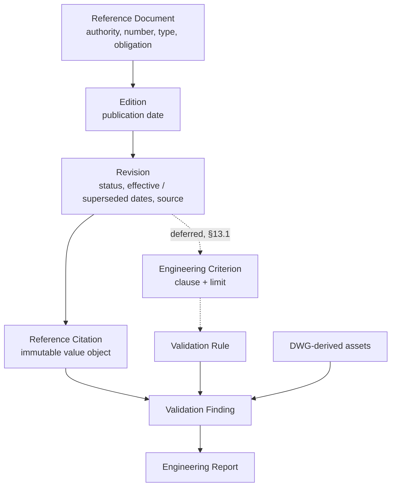

# SDS-016 – Engineering Reference and Standards Architecture

## 1. Purpose

This document specifies the architecture of AET's **engineering reference
library**: the catalogue of authoritative documents that engineering criteria
are traceable to, and the mechanism by which a validation finding can name the
exact publication, edition, revision, and clause it was judged against.

AET's existing rules check what the drawing says (SDS-005, SDS-011) or check
it against limits a caller supplies (SDS-012). Neither can say *why* a limit
is the limit. SDS-012 §4 declined to ship a regulatory number precisely
because a number with no provenance is a safety threshold asserted from
memory. This increment builds the provenance side of that argument: the place
a number will eventually come from, recorded with enough version and licence
metadata to be audited years later.

## 2. Scope

SDS-016 covers:

- Domain models for reference documents, editions, and revisions
- Authorities and document types, and the mandatory/guidance distinction
- Applicability conditions and their evaluation
- Revision lifecycle, supersession, and historical retention
- Licensing, copyright, and access metadata
- The citation carried by a validation finding
- Persistence, reusing the SDS-013 store
- Repository handling of controlled reference documents

SDS-016 does **not** cover, and §13 explains why:

- Any engineering criterion, limit, or numeric value
- The controlled criteria module the citation's `criterion_id` points into
- Retrieval, parsing, or storage of document *content*
- A catalogue file format or `aet reference` CLI subcommands
- Automated checking of whether a catalogued reference is still current

## 3. Terminology

| Term | Meaning in AET |
| --- | --- |
| **Reference document** | A publication as an identity — *ICAO Annex 14 Volume I* — independent of which issue is on the shelf. |
| **Edition** | One issue of that publication: the 8th Edition, the 2022 issue. |
| **Revision** | One amendment state of an edition, with the dates that decide what was in force when. |
| **Authority** | Who published it. Identifies the source only; it confers no criteria and no precedence. |
| **Obligation** | How binding the material is: mandatory, recommended, guidance, or mixed. |
| **Applicability** | The conditions under which a reference governs — country, airport, approach category, and so on. |
| **Criterion** | A single checkable engineering requirement stated by a revision. Deferred (§13.1). |
| **Citation** | An immutable pointer from a finding to the revision and clause it relied on. |
| **Source** | Where AET knows the document from, and what may lawfully be done with the copy. |

## 4. The DWG Remains the Single Source of Truth

Nothing in this increment weakens that principle, and the split is worth
stating plainly:

- The **DWG** is the source of truth for *project-derived engineering data* —
  which fittings exist, where they are, what circuit they are on. Every asset
  in the system still traces to a drawing entity (SDS-010) or to a registry
  reconciled against one (SDS-011).
- The **reference library** is the source of truth for *the criteria that data
  is judged against*. It holds no project data, derives nothing from a
  drawing, and is not scoped to a project.

The two meet only at the finding, which cites both: evidence pointing at
drawing-derived assets, and a citation pointing at a published clause.

## 5. Architecture



Layering follows SDS-002 §6.2 without addition:

| Component | Location | Layer |
| --- | --- | --- |
| Reference models | `src/aet/models/reference.py` | Domain |
| `ReferenceLibrary` | `src/aet/services/reference_library.py` | Application |
| Reference repositories | `src/aet/services/persistence.py`, `sqlite.py` | Infrastructure |
| Finding citation | `src/aet/models/validation.py` | Domain |
| Report reference column | `src/aet/modules/reporting_engine/engine.py` | Domain/adapter |

The library is a service, not a pipeline engine: it takes part in no stage of
the DWG-to-report pipeline of SDS-002 §7, so it does not belong under
`modules/` beside the engines that do.

## 6. Authorities

`ReferenceAuthority` enumerates `ICAO`, `UAE_GCAA`, `FAA`, `EASA`,
`AIRPORT_AUTHORITY`, `MANUFACTURER`, `PROJECT_STANDARD`, and `OTHER`.

An authority identifies **the source and nothing else**. It carries no
engineering criteria, and it establishes no precedence: which authority
governs a given project is settled by that project's applicable regulations
and its aerodrome's approved standards, not by an ordering in software.

## 7. Document Types and Obligation

`ReferenceType` covers regulations, standards, SARPs, PANS, manuals, AMC, GM,
SOPs, circulars, safety decisions, safety information bulletins, engineering
standards, airport standards, technical guidance, and `OTHER`.

### 7.1 Obligation is recorded, not inferred

Type does not settle how binding a document is, so `ReferenceObligation` is a
separate, **required** field on every catalogued document.

Inferring it would be wrong in both directions. An ICAO Annex mixes Standards
(mandatory) with Recommended Practices in one publication, so no single
obligation describes it — that is what `MIXED` is for. An AMC is neither
mandatory nor merely advisory: it is an accepted means of showing compliance.
A manual is guidance whatever its publisher's standing.

`carries_mandatory_material` answers the only question the document level can
answer honestly: whether anything inside can impose a requirement. Which
*clause* imposes one is a property of the clause, and belongs to the criteria
module of §13.1.

## 8. Domain Model

### 8.1 `ReferenceDocument`

`title`, `authority`, `document_number`, `document_type`, `obligation`,
`discipline`, `jurisdiction`, `applicability`, `notes`, `reference_id`,
`created_at`.

`catalogue_key` — authority plus casefolded document number — is the identity
an operator actually knows. Two entries sharing it are the same publication
recorded twice, which §10.1 refuses.

### 8.2 `ReferenceEdition`

`reference_id`, `edition`, `publication_date`, `supersedes_edition_id`,
`notes`, `edition_id`, `created_at`.

### 8.3 `ReferenceRevision`

`reference_id`, `edition_id`, `revision`, `status`, `publication_date`,
`effective_date`, `superseded_date`, `supersedes_revision_id`,
`superseded_by_revision_id`, `source`, `notes`, `revision_id`, `recorded_at`.

`reference_id` is carried here as well as on the edition, so every revision of
a publication is findable without walking editions. The library refuses a
revision whose document disagrees with its edition's, so the two cannot drift
— an unenforced denormalisation would be a bug waiting to happen.

### 8.4 Why three records rather than one

The metadata listed in the request — `edition`, `revision`,
`publication_date`, `effective_date`, `supersedes`, `status`, `source_url`,
`local_reference_path`, `licence_status` — does not belong to a publication.
It belongs to a particular issue and amendment of one. Flattening it onto a
single record makes "Annex 14" a thing with one effective date, which is the
mistake §10 exists to prevent.

Value objects (`ReferenceSource`, `ReferenceApplicability`,
`ApplicabilityCriterion`, `ReferenceCitation`) are frozen; the three records
that have a lifecycle are mutable dataclasses, as every other AET entity is.

## 9. Applicability

### 9.1 Dimensions

`ApplicabilityDimension` covers country, authority, airport, aerodrome,
runway, taxiway, aircraft category, approach category, lighting system,
project type, design stage, and discipline.

A `ReferenceApplicability` holds zero or more `ApplicabilityCriterion`, each
naming one dimension and the values the reference is restricted to. An
unlisted dimension is unrestricted; listing none means the reference applies
everywhere. That default is right for an ICAO Annex and wrong for an airport's
own standard, which is why it is stated on the record rather than assumed.

### 9.2 Three verdicts, not two

`evaluate` returns `APPLICABLE`, `NOT_APPLICABLE`, or `UNDETERMINED`.

The third exists because a boolean would have to guess. If a reference is
restricted to CAT-III runways and the context does not say which category the
runway is, the honest answer is that nobody knows yet — and the dangerous
failure is treating that as "applies". A definite exclusion still wins: a
context contradicting any restriction is `NOT_APPLICABLE` even when other
dimensions are unstated.

### 9.3 What is deliberately simple

Criteria are a flat conjunction over dimensions. No boolean expressions, no
nesting, no cross-dimension implication. Those become worth building when a
real reference needs them; inventing the grammar first would fix the shape of
something no catalogued document has yet demanded.

## 10. Versioning and Supersession

### 10.1 A record is never silently replaced

Re-registering an identical record succeeds and changes nothing, so a
catalogue can be loaded repeatedly and idempotently. Every other collision
fails with a named reason:

- the same `reference_id` re-registered with different metadata
- the same authority and document number under a new identifier
- the same edition name recorded twice for one document
- the same revision name recorded twice for one edition
- a revision whose named document is not its edition's document

### 10.2 Supersession is explicit and additive

`supersede(old, new)` is the only way a revision leaves force. It deletes
nothing: the retired revision keeps its record and gains `SUPERSEDED` status,
the date it was retired, and a pointer to what replaced it; the new revision
gains a pointer back. History stays walkable in both directions.

Superseding a revision that something else already superseded fails, unless it
names the same successor — a second, different supersession would leave the
catalogue with two answers about what replaced what. A revision cannot be
superseded by one of a different publication, nor by a draft or withdrawn one.

### 10.3 A finding keeps the revision it was judged against

`ReferenceCitation` is a frozen value object, and a `ValidationResult` carries
it **by value**. Amending the library later therefore cannot rewrite what an
executed run relied on: the finding still says Amendment 17, the revision it
names is still resolvable, and that revision now reads `SUPERSEDED` with the
date it stopped applying.

This is the auditability requirement, and it is pinned by test. Citing a
superseded revision remains possible for the same reason — a historical run
cited what was in force at the time, and re-stating it must keep working.

### 10.4 "What was in force" is answered or refused, never guessed

`revision_in_force(reference_id, on=...)` returns a failed `Outcome` naming
the reason when:

- no revision is in force (on that day)
- two or more are recorded in force, meaning a supersession was never recorded
- a candidate revision has no effective date, so the day cannot be resolved

Each failure means the catalogue cannot answer the question. A check run
against a guessed revision is worse than one that did not run — the same
argument SDS-012 §4 makes about limits, applied to versions.

## 11. Licensing, Copyright, and Access

### 11.1 AET never holds the document

The toolkit records **where** a document is and never opens it. There is no
download, no copy, no parse, no embedding. `local_reference_path` is metadata
for an engineer to follow; nothing in the codebase reads that path, and the
file need not exist on the machine for the reference to be citable.

This is the design property that makes the licensing question tractable: a
system that never reads the document cannot redistribute it by accident.

### 11.2 Metadata, and the safe default

`ReferenceSource` records `source_type` (`PUBLIC_OFFICIAL`, `USER_PROVIDED`,
`LICENSED_COPY`, `RESTRICTED`, `METADATA_ONLY`), `licence_status` (`PUBLIC`,
`LICENSED`, `RESTRICTED`, `UNKNOWN`), `official_url`, `local_reference_path`,
and `access_restriction` (`OPEN`, `INTERNAL`, `CONTROLLED`, `CONFIDENTIAL`).

An uncharacterised source defaults to metadata-only, unknown licence, and
controlled access. Getting this wrong in the safe direction costs one
catalogue edit; getting it wrong in the other direction publishes somebody
else's copyrighted document.

`redistributable` is true only when source type, licence, and access all say
so. **An unknown licence is not a permissive one.** A metadata-only source
that also claims to hold a local copy contradicts itself and is refused at
construction.

### 11.3 The repository holds no controlled documents

See [ADR-003](../ADR/ADR-003-controlled-reference-documents.md).
`docs/Reference/` documents the layout and ignores document binaries, so a
controlled PDF dropped there locally cannot be committed by accident. AET
does not download ICAO, GCAA, FAA, or EASA material, and does not redistribute
it.

## 12. Persistence

### 12.1 The existing store, not a second one

Three repositories join the SDS-002 §9.2 bundle — `reference_documents`,
`reference_editions`, `reference_revisions` — built from the same
`Repository[T]` protocol, the same generic `SqliteRepository`, and the same
`to_document`/`from_document` conversion as every other entity. Both the
in-memory and SQLite bundles gain them together, so substitution still holds
(SDS-013 §3).

Reference tables carry **no scope column**, because a reference belongs to the
toolkit rather than to a project: the same ICAO Annex governs every project. A
project-scoped read therefore returns none of them, exactly as it already does
for the asset relations of SDS-013 §5.1.

Applicability and source metadata live in the document body with the rest of
the entity, rather than in `reference_applicability` and `reference_sources`
tables of their own. They are value objects owned by a single parent, read
only through it, and never queried across parents — so separate tables would
buy SQL-level aggregation nothing performs, at the cost of two more
hand-written schemas, which is the trade SDS-013 §5 already weighed. If a
future query needs to ask "which references apply at OMAA" in SQL, the
normalisation is a schema change behind an unchanged `Repository` contract.

One generic addition was needed: `date` now round-trips through the document
conversion alongside `datetime`. Effective and publication dates are days,
not instants, and storing them as timestamps would invent a time of day that
no publisher states.

### 12.2 Migration safety

No migration is required, and none is included. New tables are created if
absent, exactly as SDS-013 §7 provides for; `ValidationResult` gains one
optional field, and SDS-013 §4.2 already guarantees a document missing a field
yields the default — so findings written before this increment read back with
`citation = None`. No existing table, column, or stored document changes.

## 13. Validation Engine Integration

### 13.1 The contract

A criterion-backed rule takes its limits from configuration (SDS-012 §7) and
its provenance from the library, and emits findings carrying both:

```text
Rule       agl.spacing
Finding    Taxiway edge-light spacing exceeds the configured criterion
Reference  ICAO Annex 14 Vol I, 8th Edition, Rev Amendment 17, clause 5.3.17.5
Evidence   samples: TEC102-01/067, …
Project    <project id>
```

`ValidationRule` is unchanged. Adding a required attribute to a
`runtime_checkable` protocol would break every existing rule and every plugin
that implements one, and a rule that checks data hygiene has no criterion to
cite. Instead `ValidationResult.citation` is optional, `ReferenceLibrary.cite`
is the only way to build one, and the citation is assembled from stored
records so it cannot claim an edition or revision the catalogue does not hold.

`ReferenceCitation.criterion_id` is the slot the controlled criteria module
will fill.

### 13.2 The report

`FindingLine.reference` carries the rendered citation into the reporting
engine, and the Markdown findings table grows a Reference column **only when
something cites one**. A report of hygiene findings is not padded with an
empty column implying a criterion that was never checked.

## 14. Security Considerations

- **No network access.** The library performs no retrieval. `official_url` is
  recorded and never fetched, so a catalogue entry cannot cause an outbound
  request.
- **No file access.** `local_reference_path` is never opened, so a catalogue
  entry cannot cause an arbitrary read, and a path traversal in one is inert.
- **No redistribution.** §11 and ADR-003. Access restriction is recorded per
  revision so a future export can filter on it.
- **Failures stay in the taxonomy.** Catalogue conflicts are
  `WORKFLOW_ERROR` outcomes with remediation (SDS-002 §12.2); malformed
  catalogue metadata raises `INPUT_ERROR` at construction.
- **No new dependency and no new store.** The attack surface added is the
  three tables of §12.1.

## 15. Auditability

Every registration and every supersession emits an audit event through the
SDS-002 §11.5 audit logger, so it reaches both `audit.log` and the audit data
domain. Together with §10.2 and §10.3, an engineering result stays explicable
after the fact: the finding names its revision, the revision names its
edition and document, and the audit trail records when each was catalogued and
when it was retired.

## 16. Deliberately Not Implemented

**Engineering criteria and limits.** No spacing value, loading limit, PAPI
criterion, stop-bar criterion, cable size, or civil design value appears
anywhere in this increment. Those require controlled review of the current
applicable source documents, and SDS-012 §4 sets out why guessing one is
worse than shipping none. The criteria module will hang off a revision,
keyed by clause, and `ReferenceCitation.criterion_id` is where it attaches.

**Catalogue loading and CLI subcommands.** Populating the library today means
calling the API. A catalogue file format and `aet reference` subcommands are a
coherent next increment; specifying the format before any criterion exists
would fix its shape around a guess.

**Currency checking.** Nothing verifies that a catalogued revision is still
the current one — that requires consulting the publisher. §10.4 refuses to
answer when the catalogue is incomplete, which is the honest behaviour
available without it. A filename that looks current is not evidence that a
document is.

**Document content.** Section text, clause extraction, and full-text search
would mean holding copies, which §11.1 exists to avoid.

## 17. Assumptions

1. An operator can characterise a document's licence and access position.
   Where they cannot, the defaults treat it as restricted.
2. Authority plus document number identifies a publication uniquely within one
   catalogue.
3. Editions and revisions are named as the publisher names them; AET does not
   parse or order those names, and orders revisions by effective date only.
4. A revision's effective date is the date it began to apply in the
   jurisdiction concerned, and the operator records it as such.
5. One catalogue serves the whole installation. Per-project reference sets are
   an applicability question (§9), not a scoping one.

## 18. Risks

| Risk | Mitigation |
| --- | --- |
| An operator catalogues a superseded document as in force. | §10.4 refuses ambiguous and undated queries rather than answering them; supersession is explicit and audited. |
| A restricted document is committed to the repository. | ADR-003 and `docs/Reference/.gitignore`; AET never copies a document. |
| A licence is recorded permissively by mistake. | `redistributable` requires three independent fields to agree, and defaults refuse. |
| Applicability is under-specified, so the wrong standard is cited. | `UNDETERMINED` is a distinct verdict and is never treated as applicable. |
| The criteria module arrives with a shape the citation cannot express. | The citation records identity and location only — reference, edition, revision, section, clause, criterion id — which any criterion representation can be keyed by. |
| Reference metadata drifts from a criterion that cites it. | Records are refused, never overwritten (§10.1); findings hold citations by value (§10.3). |

## 19. Future Extensions

1. The controlled criteria module (§16), and criterion-backed rules that cite
   it.
2. A catalogue file format and `aet reference` subcommands.
3. Applicability-driven rule selection: choose the rule pack from the
   references applicable to a project's context.
4. Per-project reference profiles recording which catalogued revisions a
   project was assessed against.
5. Export filtering that honours `access_restriction` when a report would
   otherwise quote controlled material.

## 20. Acceptance Criteria

SDS-016 is satisfied when:

1. A reference document records authority, document number, type, obligation,
   jurisdiction, discipline, and applicability, and gets a stable identifier.
2. Mandatory material is distinguishable from guidance, and obligation is
   recorded rather than inferred from document type.
3. Editions and revisions are separate records, each with its own identity and
   dates.
4. Registering a conflicting duplicate — of a document, edition, or revision —
   fails with a named reason, and no record is silently overwritten.
5. Supersession retires a revision without deleting it, links both directions,
   and refuses a second, different supersession of the same revision.
6. `revision_in_force` answers when the catalogue can answer and fails naming
   the reason when it cannot.
7. Applicability evaluates to applicable, not applicable, or undetermined, and
   an unstated restricted dimension never reads as applicable.
8. Source metadata records type, licence, URL, local path, and access
   restriction; the defaults are the safe ones; `redistributable` is true only
   when all three of type, licence, and access permit it.
9. Reference records persist through the existing SQLite store and survive
   process exit, including their dates, applicability, and source.
10. A validation finding carries a citation naming reference, edition,
    revision, section, and clause, and amending the library afterwards does
    not change it.
11. No engineering limit, criterion, or regulatory value is shipped.
12. All behavior above is covered by tests; `pytest`, `ruff`, `black`, and
    `mypy` pass.
